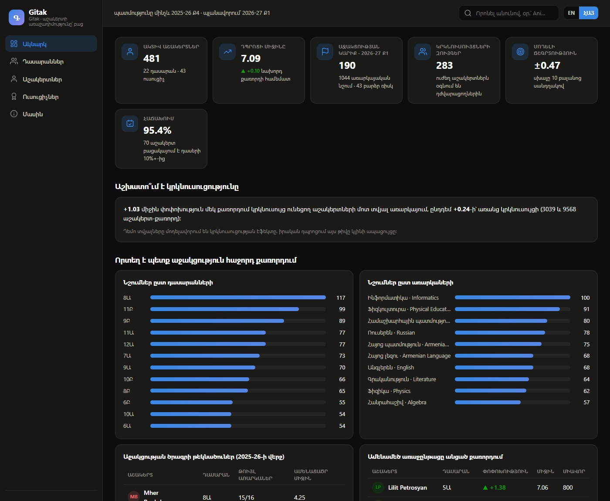

# Գիտակ · Gitak

**An open-source student-performance platform for Armenian schools.** Every grade is digital. Every student has a story the school can see and act on: not just the strongest 10 in a class of 30, but all 30.

Gitak turns a school's own exam results into decisions: who needs help next quarter, in which subject, which strong classmate could tutor them, which teachers are actually lifting their students, and which children need an intensive support program before the year slips away.



## Why

School systems mostly run on intuition and averages. A child falls behind in physics in October and it becomes visible in May, when it is expensive to fix. Gitak's premise is simple: the data already exists inside the grade book. Used honestly, it can catch the slide after the first quarter, not the last one.

The project is built for the Armenian school reality: a 10-point grading scale, 4 quarters per year, grades 1 through 12, classes that keep their letter from first grade to graduation, and the national curriculum subjects with their Armenian names.

## What it does

- **Digital grade book.** Quizzes and end-of-quarter exams, integer 1-10 grades, weighted quarter averages, all in a single SQLite file the school owns.
- **Prediction after every quarter.** A gradient-boosted model retrains on the school's entire grade history and forecasts every student's next-quarter average in every subject. Anyone forecast below 6 is flagged with a plain-language reason ("declining for several quarters; well below class average"), so the teacher knows who needs support before the quarter starts.
- **Peer tutoring groups.** For every flag, Gitak suggests a strong classmate (average 8.5+, not struggling anywhere themselves) as a tutor, at most two tutees per tutor per subject. Then it measures whether tutoring worked: the improvement of paired students vs flagged-but-unpaired ones is a first-class number on the dashboard.
- **Gitak Score, 0-1000, every quarter.** 60% level, 25% improvement, 15% consistency. A struggling student who climbs is as visible as a stable top student. Badges: class top 3, big riser, perfect quarter, mentor (your tutee improved).
- **Teacher value-added.** Growth of a teacher's students (Q4 vs Q1) compared with school-wide growth for the same subject and grade level. A teacher who inherits a weak class is not punished for it; one who inherits a strong class gets no free credit.
- **Support-program list.** Students ending the year below 6 in three or more subjects surface automatically as candidates for intensive support.
- **University tracks (grades 9-12).** Subject strengths grouped into STEM, Humanities, Languages and Arts, as a guide for the student's own choice.
- **Lifetime transcript.** One JSON export per student with every exam, score, badge and flag across all 12 years. The record belongs to the student.
- **Web dashboard.** School overview, class leaderboards, student profiles with per-subject sparklines, teacher table. English UI with Armenian subject names, light and dark mode, zero frontend dependencies.

## Quickstart

Requires Python 3.11+.

```bash
git clone <this repo>
cd gitak
python -m venv .venv
.venv/Scripts/activate        # Windows; on macOS/Linux: source .venv/bin/activate
pip install -r requirements.txt

python -m gitak demo          # synthetic school: seed + predict + pair (~1 min)
python -m gitak serve         # dashboard at http://localhost:3303
```

Other commands: `seed`, `predict`, `pair`, `report` (console summary). Run tests with `pip install -r requirements-dev.txt && python -m pytest`.

The demo school is entirely synthetic: about 600 students across grades 1-12, three full school years, 200k+ exam grades, realistic Armenian names and curriculum. No real child's data is in this repository, ever.

## Bring your own data

A real school can run Gitak on its own grade book: export one CSV (one row per grade, straight from Excel) and import it. Armenian class letters (7Ա), Armenian subject names (Հանրահաշիվ) and `2025-26` year formats are understood; validation is strict with row-level errors so a typo cannot silently poison the statistics.

```bash
python -m gitak --db data/myschool.db import grades.csv --dry-run   # validate first
python -m gitak --db data/myschool.db import grades.csv
python -m gitak --db data/myschool.db predict
python -m gitak --db data/myschool.db pair
python -m gitak --db data/myschool.db serve
```

Full column reference, replace semantics and the `--pseudonymize` option (store `Student-0001` names in the database, keep the real-name mapping inside the school): [docs/IMPORT.md](docs/IMPORT.md). A ready example file: [docs/sample-grades.csv](docs/sample-grades.csv).

## How the year works

```
Quarter ends with exams
        │
        ▼
Model retrains on the school's whole history
        │           (holdout MAE stored with every run)
        ▼
Every student × every subject gets a forecast
        │
        ▼
Forecast below 6  →  flag with a reason  →  teacher decides
        │
        ▼
Strong classmates suggested as tutors for flagged students
        │
        ▼
Next quarter's exams test whether it worked  →  repeat
```

End of year: support-program candidates surface, scores roll into the lifetime record, classes advance, and September starts with a plan instead of a blank page.

## Honesty about the model

- Features are simple and explainable: recent quarter averages, trend, standing vs class average, grade level. No black-box magic.
- Every run holds out the newest completed quarter, scores itself on it, and stores the error (MAE, currently about 0.45 on the 10-point scale for the demo school) in the `model_runs` table next to its predictions.
- The demo simulator assumes peer tutoring helps (that is why the demo's "does tutoring work" number is positive). A real school must treat that number as the thing to measure, not assume.
- New subjects with no history get no forecast. Cold start is a fact, not a bug to hide.

## Data ethics

Short version of [ETHICS.md](ETHICS.md), which is part of the project, not an afterthought:

1. **The code is public. Children's data never is.** A real deployment keeps its database inside the school.
2. **The model advises, the teacher decides.** A flag is a reason to help a child, never a label on one.
3. **The record belongs to the student.** Exportable by them, shared later in life only by their choice.
4. **Improvement counts.** Scoring rewards climbing, so the system motivates the bottom of the class instead of only decorating the top.

## Project layout

```
gitak/
  config.py     thresholds, scale, weights: the knobs
  db.py         SQLite schema and helpers
  seed.py       synthetic Armenian school generator
  scoring.py    Gitak Score, ranks, badges
  ml.py         feature building, training, forecasting, flags
  pairing.py    peer-tutoring matcher + effectiveness measurement
  teachers.py   value-added analytics
  reports.py    read-side queries for CLI and API
  api.py        FastAPI endpoints
  cli.py        python -m gitak ...
dashboard/      single-file web UI, no build step
tests/          pytest end-to-end suite
```

## Roadmap

- E-journal API connectors (beyond CSV)
- Armenian-language UI toggle
- Attendance as a model feature
- Accounts and roles (teacher, director, student, parent) for real deployments
- Alignment with Ministry of Education assessment standards
- Multi-school benchmarking with privacy-preserving aggregates

Contributions welcome. Open an issue before large changes.

## Հայերեն

Գիտակը բաց հարթակ է հայկական դպրոցների համար: Բոլոր գնահատականները թվային են, յուրաքանչյուր աշակերտ ունի իր պատմությունը, և ուսուցիչը ամեն քառորդից առաջ գիտի, թե ով որ առարկայում աջակցության կարիք ունի: Ուժեղ աշակերտները դառնում են թույլերի կրկնուսույցներ, առաջընթացը խաղի պես մոտիվացնող է, իսկ ամբողջ 12 տարվա արդյունքը դառնում է աշակերտին պատկանող թվային վկայական: Կոդը բաց է, երեխաների տվյալները՝ երբեք:

## License

MIT. See [LICENSE](LICENSE).
